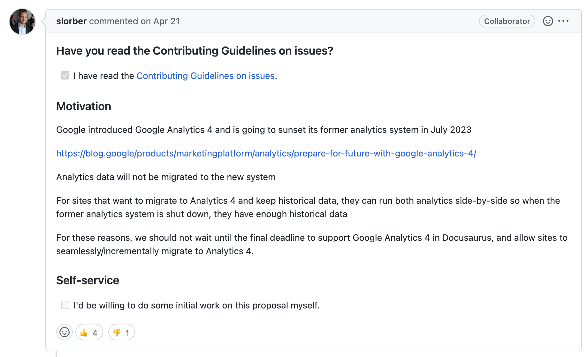

# Integrating Google Analytics with Docusaurus

## TL;DR

- [**Google Analytics 4**](https://blog.google/products/marketingplatform/analytics/prepare-for-future-with-google-analytics-4/) was introduced to meet user's needs for modern complex, multi-platform
- Previous Google Analytics, [**Universal Analytics** will begin sunsetting on July 1, 2023](https://support.google.com/analytics/answer/11583528)
- Migrate from `googleAnalytics: {}` to `gtag: {}`

<br/>

## [Issue](https://github.com/facebook/docusaurus/issues/7221) from Docusaurus maintainer

[](./img/2022-12-01-01.png)

Previous Google Analytics, Universal Analytics will stop processing data on July 1, 2023. So We need to prepare for the migration.

## So, how to migrate from GA4?

[](./img/2022-12-01-02.png)

Also, see above [issue](https://github.com/facebook/docusaurus/issues/7221#issuecomment-1112027111).

So, from Universal Analytics

```javascript
// docusaurus.config.js

presets: [
    [
        // ...
        googleAnalytics: {
          trackingID: <YOUR_TRACKING_ID>,
          anonymizeIP: true,
        },
    ]
]
```

to

```javascript
// docusaurus.config.js

presets: [
    [
        // ...
        gtag: {
          trackingID: <YOUR_TRACKING_ID>,
          anonymizeIP: true,
        },
    ]
]
```

<br/>

## Result

[](./img/2022-12-01-03.png)

So, finally Google Analytics could get data.
